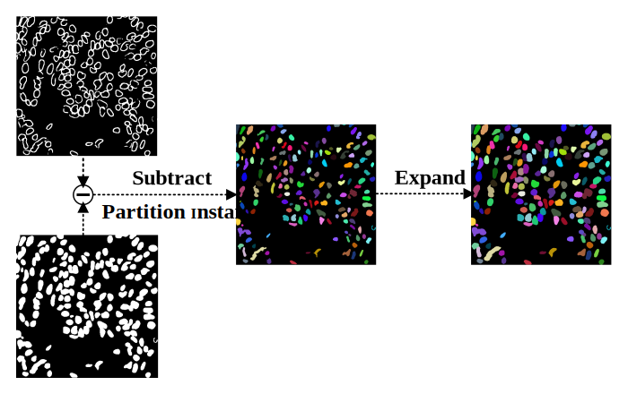

# EADB-Net


## Environment

1. [Install CUDA](https://developer.nvidia.com/cuda-downloads)

2. [Install PyTorch 1.13 or later](https://pytorch.org/get-started/locally/)

3. Install dependencies

```bash
pip install -r requirements.txt
```

## Usage

## Training

**Note : Use Python 3.6 or newer**

```conosle
> python train.py -h
usage: train.py [-h] [--epochs E] [--batch-size B] [--learning-rate LR]
                [--load LOAD] [--scale SCALE] [--validation VAL] [--amp]

Train the EADB-Net on images, target masks and target edges

optional arguments:
  -h, --help            show this help message and exit
  --epochs E, -e E      Number of epochs
  --batch-size B, -b B  Batch size
  --learning-rate LR, -l LR
                        Learning rate
  --load LOAD, -f LOAD  Load model from a .pth file
  --scale SCALE, -s SCALE
                        Downscaling factor of the images
  --validation VAL, -v VAL
                        Percent of the data that is used as validation (0-100)
  --amp                 Use mixed precision
```


Set file path: Put the original image, mask and edge in a separate folder, and set dir_img, dir_mask and dir_edge on lines 23 to 27 in the train.py

Training:

```bash
python train.py --epochs 50 --batch-size 2 --learning-rate 1e-5 --scale 0.5 --valodation 10 --amp 
```

## Prediction

After training your model and saving it to `model.pth`, you can easily test the output masks on your images via the CLI.

Predict all images in the folder and save:

```bash
python predict.py -i input_folder -output_mask output_folder
```

## Post Processing



Fuse mask and edge information to generate instance segmentation results

```bash
python instance_process.py -im true_folder -ie pred_mask_folder -o pred_instance
```

## Evaluate

After predicting the pictures in the folder, apprasie.py can be used to evaluate the prediction results.

Evaluate the predicted pictures

```bash
python apprasie.py -true true_folder -pred pred_folder
```


## Weights & Biases

The training progress can be visualized in real-time using [Weights & Biases](https://wandb.ai/).  Loss curves, validation curves, weights and gradient histograms, as well as predicted masks are logged to the platform.

When launching a training, a link will be printed in the console. Click on it to go to your dashboard. If you have an existing W&B account, you can link it
 by setting the `WANDB_API_KEY` environment variable. If not, it will create an anonymous run which is automatically deleted after 7 days.
